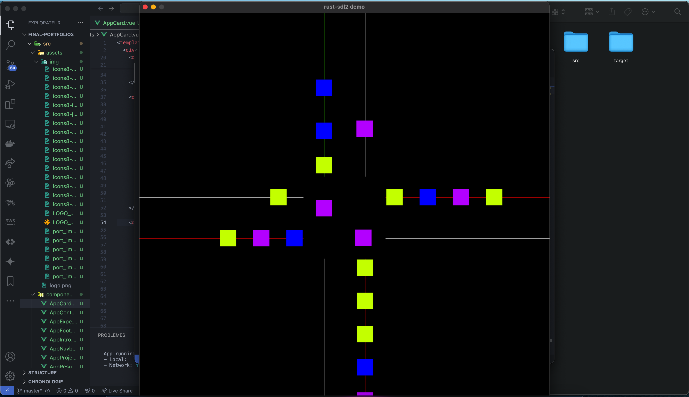

***ROAD-DIRECTION***

> Objectives

Traffic, traffic, traffic...

You will need to solve the traffic problem in your capital city. Your objective will be to create a traffic control strategy, and visualize it with a simulation.

It is up to you to decide which library and file system you want to use in order to create this simulation, but we recommend that you use the sdl2 library.

> Instructions

**Environment and Rules**

You must create an environment which contains all the objects described in this section. You can display the objects in any way you wish.

*1 Roads*

You will create two roads which cross each other to create an intersection. Each road will have one lane in each direction.

Traffic entering the intersection will be able to select a route by:

    turning left
    turning right
    continuing on straight
    
    

                        North
                    |  ↓  |  ↑  |
                    |  ↓  |  ↑  |
                    |     |     |
                    |     |     |
                    |     |     |
                    |     |     |
     _______________|     |     |_______________
     ← ←                                     ← ←
East ---------------             --------------- West
     → →                                     → →
     _______________             _______________
                    |     |     |
                    |     |     |
                    |     |     |
                    |     |     |
                    |     |     |
                    |  ↓  |  ↑  |
                    |  ↓  |  ↑  |
                        South

*2 Traffic lights*

Traffic lights are signaling devices positioned at road intersections that follow a universal color code. We all know the normal colors for traffic lights, but for this exercise, your traffic lights will only have red and green.

You will position those traffic lights at the point where each lane enters the intersection.

You can implement any algorithm you choose to control the traffic lights system, but bare in mind that traffic congestion should not be too high (8 or more vehicles).

The primary function of your traffic light system, is to avoid collisions between vehicles passing through the intersection.

*3. Vehicles*

  ______
 /|_||_\`.__
=`-(_)--(_)-'

The vehicles traveling through your capital city's new junction must follow these rules:

    * Vehicles must be painted in a color which illustrates the route they will follow. The colors are up to you to decide, and your choices will need to be made available during the audit of the raid. For example, all cars which make a right turn could be painted yellow. It's really up to you though.

    * It is not possible for the vehicle to change its selected route.

    * Each vehicle must have a fixed velocity.

    * A safety distance from other vehicles must be maintained. If one vehicle stops, the following vehicle must also stop before it gets too close to the stationary vehicle in front.

    * Vehicles must stop if the traffic light is red and proceed otherwise.

    * There are no other vehicle types with special privileges. You can consider that there are no emergency vehicles in your capital city.

**Commands**

You will use your keyboard to spawn vehicles for your simulation. You will use the arrow keys to spawn a vehicle on the appropriate side of the road, and with a random route.

    * ↑ Up: moves towards the intersection from the south.
    * ↓ Down: moves towards the intersection from the north.
    * → Right: moves towards the intersection from the west.
    * ← Left: moves towards the intersection from the east.
    * r: moves towards the intersection from a random direction.
    * Esc Escape: ends the simulation.

    > It must not be possible to use the keyboard to spam the creation of vehicles; they must be created with a safe distance between them.

    > A safe distance is any distance which enables the vehicles to avoid crashing into each other.

> Authors :
* tleulier
* drodolph
* lunterei
* tfort

Zone01 Normandie, 2024
